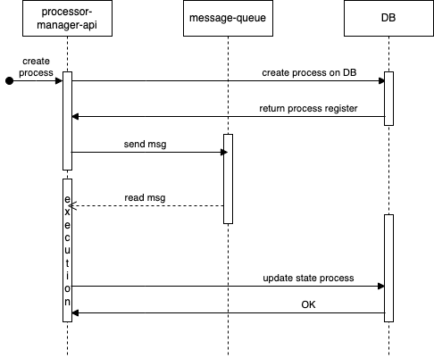

# Process-manager-api

## Endpoints
This API has the following endpoints:

- **POST /process:** create and execute an async process
- **GET /process:** get a process list
- **GET /process/{id}:** get a process 

## Design
The design of the app is the following:

This app use a Kafka and MySql client. They are configure on a Docker environment.
